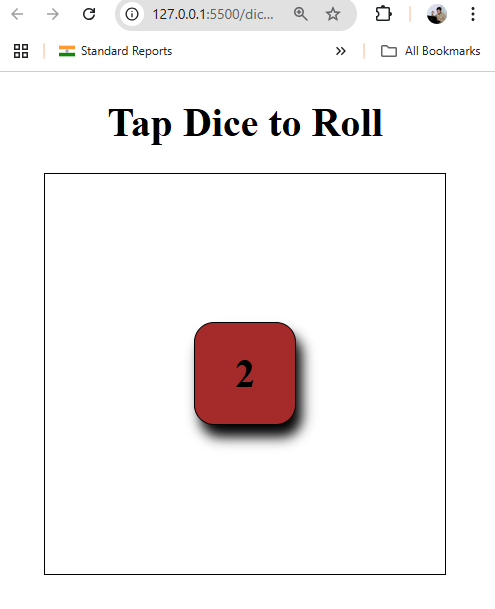

# 🎲 Dice Roller Game

A fun and interactive **Dice Roller** built using **HTML, CSS, and JavaScript**. This lightweight web app allows users to roll a digital die by clicking on it — complete with responsive design and a satisfying click sound!

---

## 🚀 Features

- 🎲 Simulates a real dice roll (1 to 6)
- 🔊 Plays sound on click
- 📱 Fully responsive design (mobile, tablet, desktop)
- 🎨 Clean and minimal UI
- ⚙️ Smooth and fast interaction with zero dependencies

---

## 📸 Preview

---

## 🛠️ Technologies Used

- **HTML5** – Structure of the game
- **CSS3** – Styling and responsiveness
- **JavaScript** – Dice logic and sound interaction
- **Audio** – Plays sound on dice roll (`click.mp3` or custom)

---
